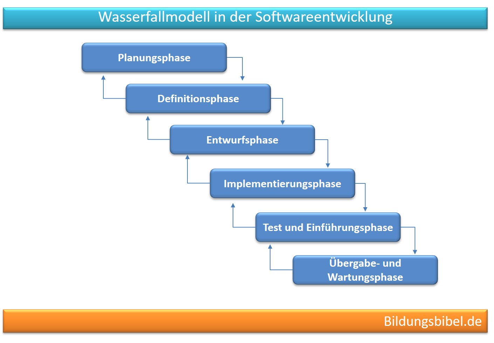
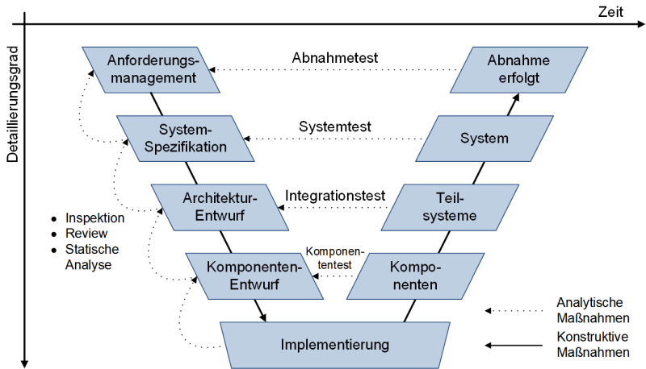
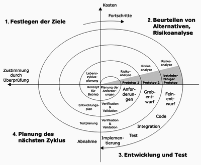
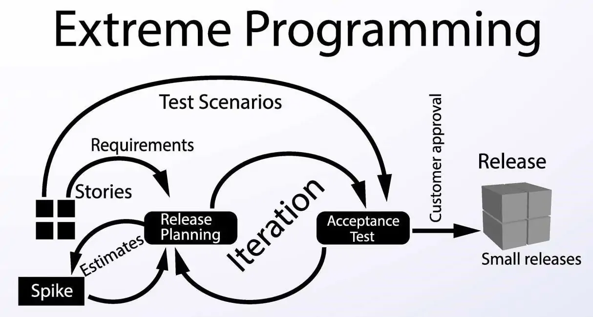
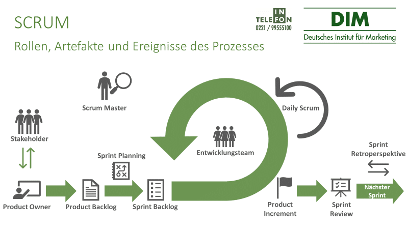
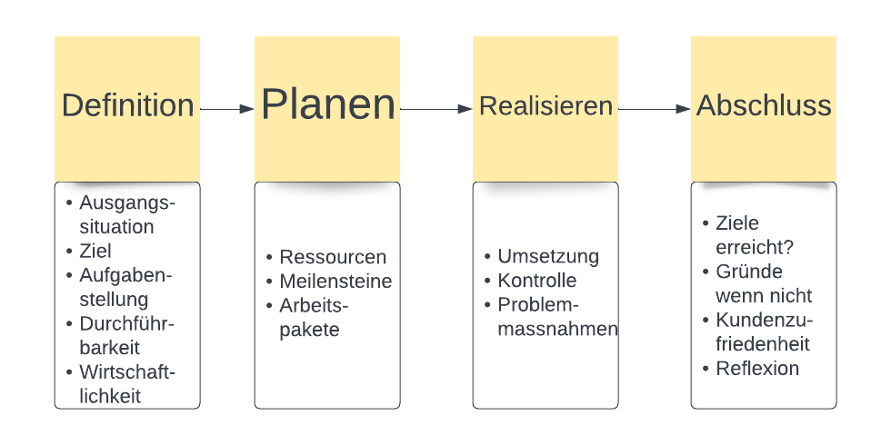

# Vorgehensmodelle

### Was sind Vorgehensmodelle?
-------
Vorgehensmodelle sind mit dem [Projektmanagement](projektmanagement.md) verknüpft. Hierbei handelt es sich um Modelle, welche, ein Projekt von der Idee bis zum Ende begeleiten. Ein paar Vorgehensmodelle, meist die statischen, ähneln [IPERKA](iperka.md). 
Es folgen ein paar Beispiele. 

#### Das Wasserfallmodell
<!---->
[^1]

#### Das V-Modell
<!---->
[^2] 

Es gibt allerdings auch agile Methoden. Das bedeutet, dass sie nicht statisch, sondern veränderbar und vorallem anpassbar sind. Sie erfolgen iterativ, also Schrittweise und nähern sich so peu à peu einer exakten Lösung an. Hier ein paar Beispiele zu den agilen Modellen:

#### Das Spiralmodell
[^3]

#### Extreme Programming
<!---->
[^4]

#### Scrum
<!---->
[^5]

Wichtig ist, dass es einen Unterschied zwischen agil und ziellos zu sein: Agil heisst mit Hilfe von kleinen Schritten und einem beweglichen Ziel dem Kunden den Nutzbarkeiten zu geben, welche er sich wünscht und die Kundenzufriedenheit sicher zu stellen. 

Im Folgenden möchte ich genauer auf das Vierphasenmodell eingehen. 
#### Das Vierphasenmodell

Das Vierphasen-Modell ist ein statische Modell. Es folgt vier Phasen und ist einfach verständlich. 
Die erste Phase ist die **Definition**: In dieser Phase wird erörtert wie die Ausgangslage und die Aufgabenstellung aussehen, es wird gefragt, ob idie Durchführbarkeit gewährleistet und eine Wirtschaftlichkeit geben ist? Das bedeutet, dass alle Kontextsachen geklärt werden um eine solide Ausgangslage zu schaffen. 
Die zweite Phase ist das **Planen**: Hier geht es darum die Ressourcen, also Geld, Personal, Zeit und verfügbares Material einzuplanen. Ausserdem werden die Meilensteine des Projektes gesetzt um eine zeitliche Absteckung zu haben. Letztlich werden noch die [Arbeitspakete](projektmanagement.md) aufgeteilt und definiert. 
In der dritten Phase geht es um das **Realisieren**: Es erfolgt die Umsetzung der Planung, eine Kontrolle und allfällige Probleme erfahren Massnahmen um sie zu beheben. 
Als letzte Phase folgt der **Abschluss**: Hier wird hinterfragt, ob die Ziele erreicht wurden und mögliche Gründe werden herausgefunden, falls die Ziele nicht erfüllt wurden. Dann wird hinterfragt, ob der Kunde zufrieden ist und eine Reflexion erfolgt. 
Soweit zum Vierphasenmodell. Vorgehensmodelle finden sich in vielen Projekten und werden dort angewandt. In der IT ist das Scrum-Modell sehr beliebt. Ich habe selbst beobachten können, wie es in der Roche zum Einsatz kommt. Mehr dazu im Praxistransfer. 

[^1]: [Wasserfallmodell](https://www.google.com/imgres?imgurl=https%3A%2F%2Fmanagement.bildungsbibel.de%2Fwp-content%2Fuploads%2F2020%2F05%2Fwasserfallmodell-softwareentwicklung.jpg&imgrefurl=https%3A%2F%2Fmanagement.bildungsbibel.de%2Fprojektmanagement-wasserfallmodell-softwareentwicklung-phasen&tbnid=-fKimRcoHiNTYM&vet=12ahUKEwjM7avqvoL7AhUiT6QEHYSMDFoQMygAegQIARAj..i&docid=PccO5sr7D4D3WM&w=1410&h=980&q=wasserfall%20modell%20bildungsbibel&ved=2ahUKEwjM7avqvoL7AhUiT6QEHYSMDFoQMygAegQIARAj)
[^2]: [V-Modell](https://www.google.com/imgres?imgurl=https%3A%2F%2Fwww.peterjohann-consulting.de%2F_images%2Fpeco-v-modell-software-engineering-xl.png&imgrefurl=https%3A%2F%2Fwww.peterjohann-consulting.de%2Fv-modell%2F&tbnid=pW1-mGgr8CdC-M&vet=12ahUKEwinq-T3voL7AhV0picCHe9rDEYQMygGegUIARDkAQ..i&docid=7C-ikmJN16r6WM&w=800&h=458&q=vmodell&ved=2ahUKEwinq-T3voL7AhV0picCHe9rDEYQMygGegUIARDkAQ)
[^3]: [Spiralmodell](https://www.google.com/url?sa=i&url=https%3A%2F%2Fibkastl.de%2Fwiki%2FSpiralmodell&psig=AOvVaw0H2qZhZ0odjqQo5F7XCrPa&ust=1667031666431000&source=images&cd=vfe&ved=0CA0QjRxqFwoTCLj8rYa_gvsCFQAAAAAdAAAAABAD)
[^4]: [Extremeprogramming](https://www.google.com/imgres?imgurl=https%3A%2F%2Fwww.digite.com%2Fwp-content%2Fuploads%2F2019%2F09%2FExtreme-Programming-XP.jpg&imgrefurl=https%3A%2F%2Fwww.digite.com%2Fagile%2Fextreme-programming-xp%2F&tbnid=Tr8FN8h-3ZJfZM&vet=12ahUKEwjhz8Oav4L7AhUcgCcCHQWJCHcQMygBegUIARDnAQ..i&docid=VYrmEoXrwMb3tM&w=1214&h=650&q=extremeprogramming&ved=2ahUKEwjhz8Oav4L7AhUcgCcCHQWJCHcQMygBegUIARDnAQ)
[^5]: [Scrum](https://www.google.com/imgres?imgurl=https%3A%2F%2Fwww.marketinginstitut.biz%2Fblog%2Fwp-content%2Fuploads%2F2020%2F09%2FSCRUM-1.png&imgrefurl=https%3A%2F%2Fwww.marketinginstitut.biz%2Fblog%2Fscrum%2F&tbnid=A3rNrZb-0iqLAM&vet=12ahUKEwid-K2wv4L7AhX7S6QEHQRJAT4QMyg9egQIARB6..i&docid=5lw78JzBGhladM&w=800&h=450&q=scrum&hl=en&ved=2ahUKEwid-K2wv4L7AhX7S6QEHQRJAT4QMyg9egQIARB6)

### Praxistransfer
-------
Wie bereits oben erwähnt verwenden wir in der Roche Scrum. Jeder arbeitet an seinem Ticket. Diese Tickets sollen in einem gewissen Zeitraum abgearbeitet werden. Ausserdem treffen sich viele meiner Kollegen täglich zu einem Daily. Ich selbst durfte auch schon an ein paar Dailys teilnehmen. Es ist sehr spannend. Denn jeder erzählt, was er zuvor gemacht hat und was er am aktuellen Tag noch machen möchte. Dabei werden sowohl Erfolge als auch Misserfolge erzählt. Sind die Problemstellungen etwas komplexer, versuchen die anderen Hilfestellung zu geben und so neue Ideen zu geben. Das hilft oft. Allerdings kommt es trotzdem vor, dass Leute ihr Ticket nicht abarbeiten können. Wenn das einmal der Fall ist, wird das an die nächste Person weitergereicht und es wird geschaut, wo genau das Problem lag und ob vielleicht das Ticket umändern sollte. 

### Reflexion
-------
Vorgehensmodelle helfe ein Projekt zu strukturieren. Ich finde es gut, dass es so viele von ihnen gibt. Das macht es leichter sich ein Vorgehensmodell für sein eigenes Projekt auszusuchen. Ausserdem ist es spannend die Statistik der Modelle zu betrachten. Denn auch wenn die statischen Modelle weniger erfolgsversprechend sind, wie die agilen, so ist es trotzdem schön zu sehen, dass die Modelle noch verwendet und überarbeitet werden.
Ich selbst kannte die Vorgehensmodelle noch nicht. Ich habe feststellen können, dass der gemeinsame Nenner die Struktur ist. Daher versuche ich, seit wir die Vorgehensmodelle behandelt haben, Aspekte von ihnen in meine eigene Arbeit einfliessen zu lassen. Wenn ich einen Auftrag bekomme schaue ich mir zunächst die Ausgangslage an und gehe meine Ressourcen durch. Dann schaue ich, was als Endprodukt gewünscht wird und arbeite mich so peu à peu vor. Ausserdem reflektiere ich am Schluss mein Resultat und schaue was gut und was nicht so gut gelaufen ist und versuche es in Zukunft besser zu machen. 
Allerdings mit einer Ausnahme: Wenn ich etwas hundert mal gemacht habe und es funktioniert nicht, und beim huntert und ersten mal funktioniert es dann doch wie ein Wunder, dann speichere ich das Ergebnis ab und bete, dass es nach dem Neustart noch so funktioniert wie ich will oder ich verzichte im besten Fall sogar auf den Neustart. Aber ich glaube das umfasst nur das Theam VMs und Windowsserver. Vielleicht wird das in Zukunft für mich doch noch berechenbarer und somit auch strukturierbar. 
